## Project Summary:

Our RL project focuses on the Snake game's "cheese" variation, where the snake now has a gap in between every single body part following the head, allowing it to maneuver through its own body. This addition to the original game introduces a lot more freedom of movement into the game, since now the snake does not have to actively work around its own body, but also has to be careful to time its maneuvers correctly. Much like the classic version, the snake agent can choose to turn right, turn left, or continue going forward. The snake will also terminate once it collides with the wall or itself. Whenever the snake eats an apple, the snake will add a new body tile and gap. Our project uses the Proximal Policy Optimization (PPO) algorithm to train our snake agents to maximize the total game score and to efficiently navigate the board while doing so. Our project focused on a grid of size 30 by 24 tiles with the snake initially having 4 body tiles.

This project consists of two phases:

### Phase 1: Classic Cheese Variation

In this phase, we kept the basic cheese variation setup, as described above. The main goals of this phase were to try to maximize fruit score and to eliminate highly undesirable behavior early on so that these issues don't persist in phase 2, when our setup becomes much more complicated.

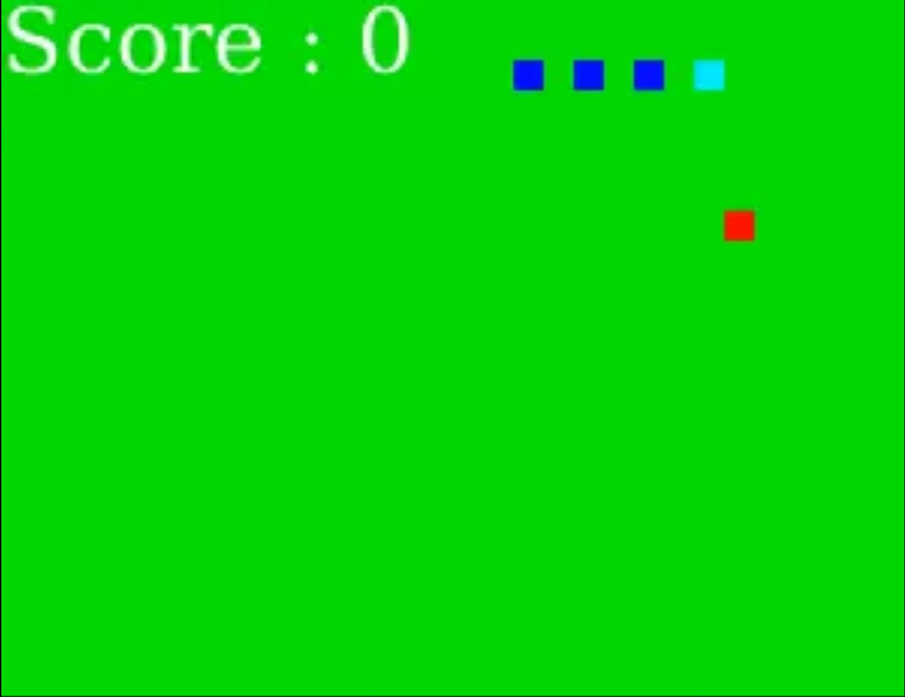

### Phase 2: Additional Special Fruit

In this phase, two additional fruits were added: the decay fruit and the enemy fruit. The decay fruit (yellow) starts with an initial score of 5 and decreases by 1 every 5 steps, respawning at a new location when it hits 0. The enemy fruit is depicted as purple and follows a set square path. When it collides with the snake head or body, it decreases the score by 1 and also subtracts the tail body segment, meaning that the snake can also die if it eats too many enemy fruits.

Altogether, these features create a dynamic environment where the agent must plan ahead, balance immediate and future rewards, and adapt to changing conditions. A non-RL approach, such as a fixed algorithm, would struggle to handle the many complex, case-by-case situations that can arise. Even in the classic cheese variation, fully exploiting the gaps in the snake’s body is challenging, as the snake has increased freedom to move through itself in order to avoid death or efficiently collect fruit. With the addition of decaying and enemy fruit, the agent must also strategically choose which fruit to pursue based on location and timing. Machine learning algorithms are well suited to this type of dynamic environment, as they allow the agent to learn strategies from experience and make decisions that balance both short-term rewards and long-term outcomes. Through this project, we aim to discover what an optimal strategy looks like for our environment and understand how our RL agent can effectively navigate the snake’s gaps, weigh trade-offs to prioritize fruit, and adapt to a constantly changing game state in order to maximize its score.

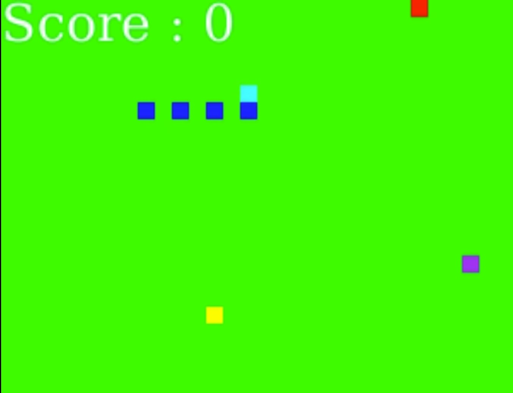

### DQN

Towards the end of our project, since we had stable results for phases 1 and 2, we also attempted to train a Deep Q-Network (DQN) on our phase 2 environment to compare against PPO. We chose DQN because it is well-suited for discrete action spaces, and it learns a Q-value function that estimates the expected return for each action in a given state, which aligns naturally with the snake game’s setup. Our environment was the same as phase 2.

## Approach

We focused on using the Proximal Policy Optimization (PPO) algorithm to train our agents in both phases of our project. We decided on using this algorithm because our action space is discrete (at each time step, we have the option of left, right, or forward), which PPO works well with. We train the PPO agent with the `MultiInputPolicy` from `Stable-Baselines3`, since its support for dictionary observation spaces is beneficial for including multiple types of information in our observation space, as will be discussed in more detail later in the report. Specifically, we use the clip version of the PPO algorithm. This was since the clip version prevents drastic updates to the policy itself, allowing the agent can improve gradually through fine-tuning how it should navigate body gaps, prioritize fruits, and avoid hazards without ignoring previously effective strategies. Clipping the probability ratio prevents the agent from making drastic jumps that abandon successful behavior in place of erratic turns, which could easily land the snake in a terminated state since one wrong turn can cause it to overconsume enemy fruit and hit the wall or itself. Policies are updated using:

$$
{E}_{(s,a)∼p\overline{\theta}}[L\frac{\theta}{\theta}(s,a)] 
$$

where L is given by:

$$
L\frac{\theta}{\theta}(s,a)=min(\rho\frac{\theta}{\theta}(a|s)A_{\overline{\theta}}(s,a), {A_{\overline{\theta}}(s,a)}+{|\epsilon A_{\overline{\theta}}(s,a)|}
$$

For the environment setup, we adapted a classic snake game pygame provided by this [GeeksForGeeks article](https://www.geeksforgeeks.org/python/snake-game-in-python-using-pygame-module/) into the cheese variation and added configurable parameters such as board size and optional rendering and debug modes. We then linked this pygame with a Gymnasium environment. In phase 2, we made further adjustments to the snake game so that it can fully support all the different types of fruit and the behavior it induces on the snake.

We decided to train on 1 million timesteps for both phases. However, at the very beginning of phase 1, we did train on 25k-50k timesteps in order to verify our setup. Additionally, we kept the default PPO parameters because PPO is very sensitive to hyperparameters and can quickly become unstable, and whenever we made adjustments to its parameters the results were always significantly worse. These hyperparameters are defined in [Stable-Baselines3 PPO documentation](https://stable-baselines3.readthedocs.io/en/master/modules/ppo.html), and are as follows:

| Hyperparameter              | Value |
| --------------------------- | ----- |
| Learning rate               | 3e-4  |
| Gamma (discount)            | 0.99  |
| Clip range                  | 0.2   |
| GAE lambda                  | 0.95  |
| Number of steps per update  | 2048  |
| Number of epochs per update | 10    |
| Batch size                  | 64    |

### Phase 1
#### Observation Space

Our observation space for phase 1 consists of the following:
- "agent": snake head's current position on the grid (2D coordinate)
- "target": current position of the fruit
- "danger": indicates whether moving in each cardinal direction (up, down, left, right) would result in an immediate collision with itself or a wall, using a dictionary that maps direction with the danger (or lack of)

Initially, the agent only observed its head and fruit location. This led to poor learning as the agent completely ignored its own body, and frequently ran into it as a result. We added an extra "danger" observation that would help the snake detect the board boundaries or parts of its tail based on the next move.

#### Reward System

For our phase 1 reward system, we started with an extremely simple reward system:
- **+1** if the score increased after the chosen action
- **-1** if the game terminated (snake agent ran into a wall or itself)
- **-0.01** for every action the snake took to encourage fruit consumption

<figure>
<video width="320" height="240" controls>
  <source src="./images/eval-episode-64.mp4" type="video/mp4">
  Your browser does not support the video tag.
</video>
    <figcaption>Example of a snake rushing towards the wall instead of the fruit in order to end the run.</figcaption>
     
</figure>

As we tuned our reward system, we observed several persistent undesirable behaviors such as circling the fruit instead of eating it, intentionally killing itself early on, and taking excessively long and winding paths. Circling the fruit was due to us rewarding the snake based on distance, and so it began prioritizing staying close instead of eating the fruit and hunting for the next one. Intentionally dying early on was because we introduced a survival pressure hoping that it would motivate the snake into finding the fruit faster, but because our initial survival pressure was too high the snake decided that it could get a less negative reward by dying soon. Excessive turning was also due to its desire to shorten the distance quickly at each time step, and so we penalized turning by a little. We also discovered that we had to be very careful with our penalizations, since being even a little too aggressive would throw the snake off entirely. For example, when we tried to reduce the turns the snake made by penalizing turns heavily, it would wound up making less turns but misses the apple.

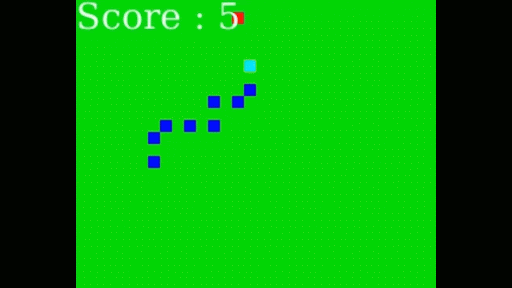
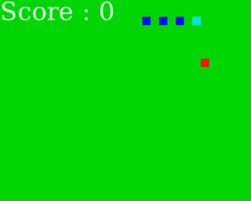
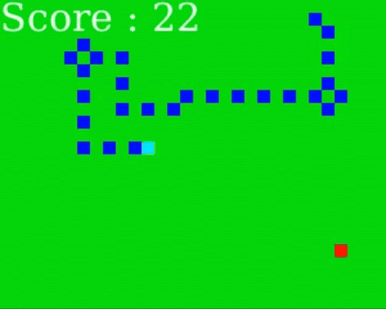 
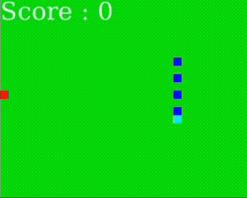

In the end, our final phase 1 reward system was:
- **+2** if the score increased after the chosen action
- **-1** if the snake agent ran into itself
- **-1.5** if the snake agent ran into a wall
- **-0.01** for every turn the snake took
- **+0.1** if the chosen action resulted in the snake agent getting closer to the fruit
- **-0.1** if the chosen action resulted in the snake agent getting farther from the fruit

<figure>
<video width="320" height="240" controls>
  <source src="./images/eval-episode-64.mp4" type="video/mp4">
  Your browser does not support the video tag.
</video>
    <figcaption>Example of a run with the final reward system for phase 1.</figcaption>
     
</figure>

This updated reward system helps the agent know that the fruit is the main goal of the training process, resulting in the snake agent focusing on the fruit rather than finding a fast way reduce its penalty as much as possible.

### Phase 2
#### Observation Space

Our observation space for phase 2 consists of the following:
- "agent": snake head's current position on the grid (2D coordinate)
- "fruits": current positions and normalized values of all three fruits (regular fruit, decay fruit, enemy fruit) in the form: `[x, y, normalized_score_value]` for each fruit stored in a 2D array
- "danger": indicates whether moving in each cardinal direction (up, down, left, right) would result in collision with itself or a wall, using a dictionary of where dangers are based on direction
- **"enemy_danger"**: indicates whether the next move of the enemy fruit on its set square path would result in the snake eating the fruit

#### Reward System

For our phase 2 reward system, our initial reward system was the same as phase 1's final reward system.

<figure>
<video width="320" height="240" controls>
  <source src="./images/phase2_initial.mp4" type="video/mp4">
  Your browser does not support the video tag.
</video>
    <figcaption>Example of a snake constantly running into the enemy fruit.</figcaption>
     
</figure>

As this second phase added two new fruits (the decay fruit and the enemy fruit) to the Snake game, we observed new issues:
- The snake agent would constantly run into the enemy fruit
- The snake agent couldn't decide whether to eat the regular fruit or the decay fruit, going back and forth without eating either of them
- The snake agent ignored the regular fruit in many cases, chasing solely the decay fruit, even if it wouldn't reach the decay fruit in time 

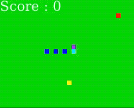
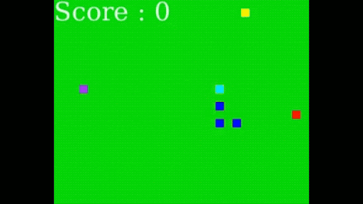
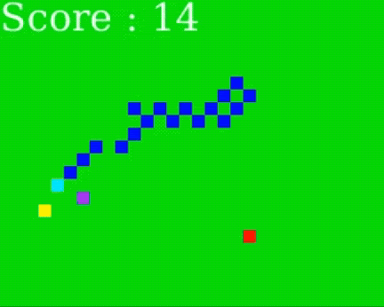 

To improve learning, we introduced a distance-based shaping term that provides feedback on the snake’s progress toward the nearest fruit, encouraging efficient fruit collection. Distances are normalized using the Euclidean distance across the grid to ensure that reward changes are proportional, regardless of the snake’s position. The shaping term's formula is:

$$
S=0.5\times\frac{d_{prev} - d_{curr}}{\sqrt{L^2_x+L^2_y}}
$$

where  $$d_{prev}$$ and $$d_{curr}$$ are the distances between the snake head and the target fruit before and after it takes a step, and $$L_x$$ and $$L_y$$ are the board dimensions. Shaping adjustments were also applied based on each type of fruit so that the snake has the full context on which fruit would be the most helpful in score maximization.

Our final phase 2 reward system was:
- **+20** * $$\Delta\, \text{score}$$ on score increase
- **−15** * $$\Delta\, \text{score}$$ on score decrease
- **-12** if the game terminated (snake agent ran into a wall, itself, or died to an enemy fruit)
- **-0.01** for surviving
- **-0.003** for changing directions
- **-0.05** for moving away from any fruit
- **+0.5** * (normalized distance change to closest fruit) for feedback on snake progress towards fruits
- **+S** move toward regular fruit
- **-2S** move toward enemy fruit to heavily discourage it
- **+(1 + 2 * value_ratio) * S** for eating decay fruit. `value_ratio` is equal to $$\frac{\text{current value of the fruit}}{\text{maximum value of the fruit}}$$, to let the snake know the sooner it collects decay, the better.

<figure>
<video width="320" height="240" controls>
  <source src="./images/phase2_final.mp4" type="video/mp4">
  Your browser does not support the video tag.
</video>
    <figcaption>Example of a run with the final reward system for phase 2.</figcaption>
     
</figure>

### DQN 

The initial reward system was based off our best one in phase 2. In general, the snake agent's performance was abysmal and ate no fruit at all, instead heavily favoring survival only.

We suspected that DQN performed poorly in our environment because our reward system was too complex for DQN. The agent had to consider multiple factors simultaneously, such as distance to several fruit types, decaying fruit values, and enemy fruit positions. This likely made the Q-function difficult to approximate, since DQN assumes a single flat input vector and a relatively simple mapping from state to action values. Our dictionary-based observation space had to be flattened, which may have disrupted the spatial relationships and context the agent relied on to make decisions.

After simplifying down our reward system however, it did not do much better. The snake movements still looked largely erratic and random despite training on 1 million timesteps. The snake was, however, able to eat fruit very occasionally, which was an improvement from before.

<figure>
<video width="320" height="240" controls>
  <source src="./images/approach_dqn.mp4" type="video/mp4">
  Your browser does not support the video tag.
</video>
    <figcaption>Example with the final DQN reward system.</figcaption>
     
</figure>

After some more exploration, our latest reward system was as follows:

- **-0.05** for surviving
- **+30** * $$\Delta\, \text{score}$$ regardless of increase/decrease
- **-25** if the game terminated (snake agent ran into a wall, itself, or died to an enemy fruit)

Originally, we also tried adding more feedback such as including distance reward back in, but that made performance worse and much more erratic than this simple system.

We also tuned some hyperparameters as shown below:

- **learning_rate**: We raised it from 1e-4 to 3e-4 so that the Q-network would update more quickly, since early runs showed very slow improvement.
- **buffer_size**: Decreased from 1,000,000 to 200,000 so that training samples were drawn from more recent gameplay behavior.
- **learning_starts**: Increased from 100 to 20000 in hopes of allowing the replay buffer to collect more information before updating, so that it does not have misled updates which may have caused the stagnation of its learning in earlier runs.
- **batch_size**: Increased from 32 to 128 since we wanted more stable updates. Because the environment contains competing reward signals (fruit rewards, penalties, and distance shaping), smaller batches would have noisy gradient updates, which may have led to erratic behavior during training.
- **target_update_interval**: Reduced from 10000 to 1000 so that Q-values would be kept closer to the current policy to prevent the Q-network from learning from outdated information, which can destabilize training.
- **exploration_fraction**: Increased from 0.1 to 0.4 to allow the agent to explore the environment longer before converging, since it was not discovering useful behaviors early in training.

All the other original hyperparameters can be referenced in the Stable-Baselines3 [documentation](https://stable-baselines3.readthedocs.io/en/master/modules/dqn.html).

In conclusion and after some research, while DQN can perform reasonably well in simpler environments with discrete actions, it struggled in our Phase 2 Snake environment due to the complexity and dynamics introduced by the decaying and enemy fruits. Additionally, DQN’s reliance on epsilon-greedy exploration proved inefficient in an environment that constantly changes, as the agent could not explore effectively without either over- or under-prioritizing certain states. Overall, these limitations indicate that DQN is better suited for less dynamic or simpler versions of the Snake game, whereas more adaptive methods like PPO are more appropriate for more complex environments such as moving hazards or decaying rewards (Zhang, 2025).

## Evaluation

For each phase, we evaluated quantitative training metrics and final model performance averages across 50 episodes in addition to analyzing snake behavior through the recorded videos.

### Phase 1
After retrieving the results of our 1 million timestep training process, we noticed significant improvement between initial stages of training:

[initial video]

[final video]

For our training process, we evalauted its quantitative metrics through parsing the slurm file, and generated graphs:

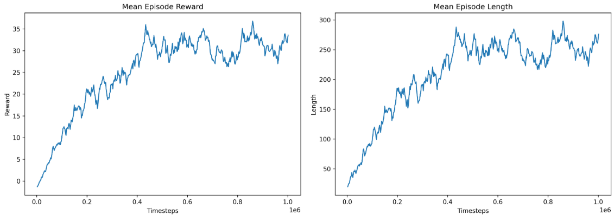

Looking at the plot, we can observe that as training progresses, there is steady improvement in both the mean episode reward and mean episode length, with some fluctuations. This indicates that our agent was steadily improving and learning behaviors that allowed it to survive longer while collecting more apples. The improvement in performance appears to plateau slightly over time, which suggests that the agent is approaching convergence and is no longer discovering significantly better strategies.

As mentioned in our Approach section, a lot of the undesirable behavior we had before (circling fruit, dying early, etc.) has been mostly eliminated. The snake has now become very intentional with its movement and the amount of turns it takes has reduced considerably. Through these videos, we can observe that the snake has learned to adopt the cheese mechanic and is able to use it for more efficient fruit collection or to avoid collision with the wall. Moreover, while we were evaluating our final model, we were able to see multiple 50+ runs. 

<figure>
<video width="320" height="240" controls>
  <source src="./images/phase1_55.mp4" type="video/mp4">
  Your browser does not support the video tag.
</video>
    <figcaption>Example with the final phase 1 reward system.</figcaption>
     
</figure>

Additionally, the performance of our final model is shown below, averaged across 50 episodes:

----- 

[description]

While the snake ultimately was very successful, we still had some small issues, such as our snake agent sometimes still taking many more turns than necessary. However, this was unavoidable since harshly penalizing turning would lead to the snake "missing" the apple and having to repeatedly cycle. One downside of keeping this issue was that it sometimes led to the snake dying because its body had become too tangled for the snake to maneuver out of, as any movement would end in a termination. 

### Phase 2
We also similarly saw a vast jump in performance for phase 2:

[initial video]

[final video]

Our training process' slurm file also produced the following quantitative metrics:

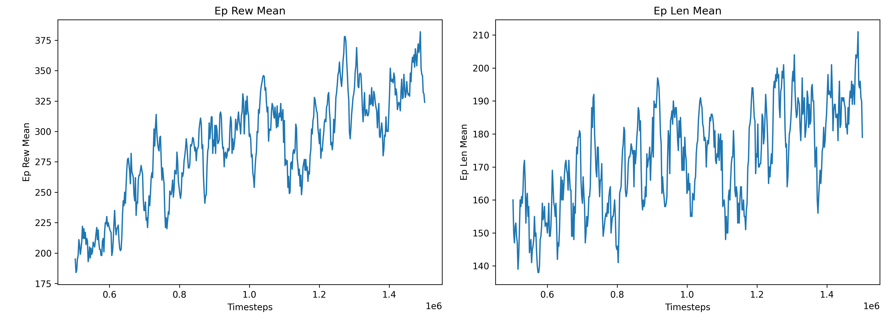

We can see from these graphs that while the training was not as stable as in Phase 1, there is still overall improvement as training progresses, even though the fluctuations are more extreme. This is expected since our Phase 2 environment is much more complicated than before. The decay fruit can respawn before being eaten and the enemy fruit moves every timestep, both of which introduce more variation in the rewards and make each run less predictable. Because of this, the training curves appear noisier, but they also show that the agent is learning to handle a more dynamic environment. Additionally, there are situations where the snake can safely move through an enemy fruit’s path, only for the enemy fruit to later collide with one of its body tiles, which creates unavoidable negative outcomes that add to the variation in rewards. The reward values are also much higher compared to Phase 1 because our updated reward system accounts for more behaviors and increases the value of collecting fruit.

During phase 2, we also included a way for us to log our fruit counts in slurm so that we have a better idea of how our model is behaving with respect to each fruit:

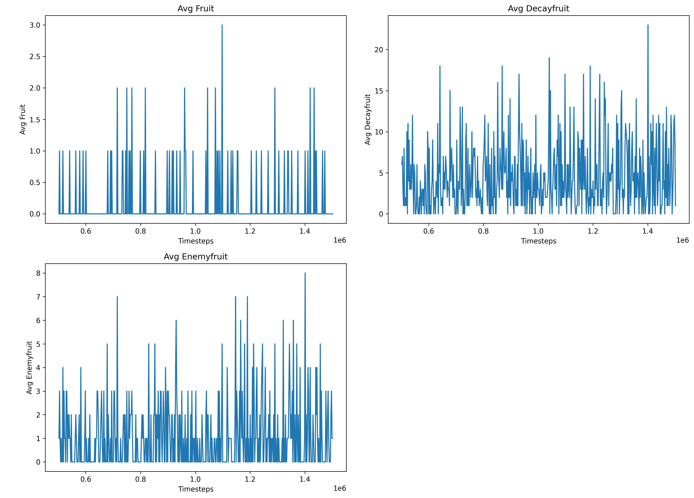

From the graphs about the fruit, we are alo able to observe that the snake heavily favored decay fruit. Regular fruit was largely ignored, and the snake even seemed to run into the enemy fruit at a higher frequency than regular fruit, though this could be due to what we mentioned above where the enemy fruit collided with a later body part.

The performance of our final model is shown below, averaged across 50 episodes:

| Metric            | Value |
|-------------------|-------|
| Average Reward    | 143.06 |
| Reward Std Dev    | 81.94 |
| Average Length    | 189.44 |
| Average Score     | 20.24 |
| Length Std Dev    | 123.35 |
| Max Reward        | 332.11 |
| Min Reward        | 13.01 |
| Avg Regular Fruit | 0.20 |
| Avg Decay Fruit   | 8.22 |
| Avg Enemy Fruit   | 1.84 |

These metrics also show the same fruit preference pattern. We can also note the average score of 20.24. This is likely because the agent is still somewhat unstable, which may be due to the environment dynamics such as the decay fruit and enemy fruit movement patterns that can sometimes cause many collisions or early deaths. However, the average episode length suggests that the snake usually survives for a long time before dying, indicating that it has still learned reasonably effective survival behavior.

Here is one of our best runs below, where it reinforces a lot of the fruit-seeking and navigation behavior we already discussed above:

<figure>
<video width="320" height="240" controls>
  <source src="./images/phase2_45.mp4" type="video/mp4">
  Your browser does not support the video tag.
</video>
    <figcaption>Example with the final phase 2 reward system.</figcaption>
     
</figure>

### DQN
For DQN, while we saw some improvement, it ultimately did not see significant development like our first two phases:

<figure>
<video width="320" height="240" controls>
  <source src="./images/init_dqn.mp4" type="video/mp4">
  Your browser does not support the video tag.
</video>
    <figcaption>Before DQN training.</figcaption>
</figure>

<figure>
<video width="320" height="240" controls>
  <source src="./images/final_dqn.mp4" type="video/mp4">
  Your browser does not support the video tag.
</video>
    <figcaption>After DQN training.</figcaption>
     
</figure>

The slurm file provided the following training metrics:

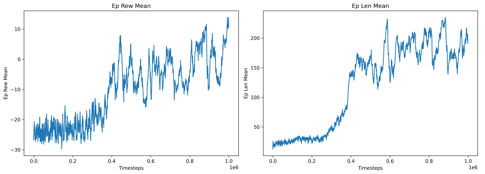

From these plots, you can see that the performance is substantially worse than PPO, and that the snake agent largely favored simply surviving over increasing its score. This can be seen in the episode length mean being almost on par with phase 2's, but the reward mean is much lower and even in the negatives for a really long time, indicating that it spends a long time not collecting any fruit at all, accumulating survival penalty before dying.

The performance of our final model is shown below, averaged across 50 episodes:

| Metric            | Value  |
|-------------------|--------|
| Average Reward    | 38.31  |
| Reward Std Dev    | 106.61 |
| Average Length    | 644.56 |
| Average Score     | 2.54   |
| Length Std Dev    | 652.64 |
| Max Reward        | 411.68 |
| Min Reward        | -160.50|
| Avg Regular Fruit | 1.08   |
| Avg Decay Fruit   | 0.96   |
| Avg Enemy Fruit   | 1.16   |

From these metrics, we can see that it collects fruits very rarely, and it actually seems to favor regular fruit a little more than decay fruit, which is surprising. However, it does run into enemy fruit quite often. The average of 2.54 is also extremely low, most likely due to not really collecting fruit and accumulating various penalties over time before dying.

## Resources Used

- [Gymnasium Custom Environment Documentation](https://gymnasium.farama.org/tutorials/gymnasium_basics/environment_creation/) used for creating a custom Snake game RL Environment
- [Gymnasium Video Recording Wrapper Documentation](https://gymnasium.farama.org/main/_modules/gymnasium/wrappers/record_video/) used for visualizing the training process of the snake agent
- [Stable-Baselines3 Callbacks Documentation](https://stable-baselines3.readthedocs.io/en/master/guide/callbacks.html) used for tracking score statistics and storing model checkpoints
- [Matplotlib Documentation](https://matplotlib.org/stable/index.html) used for displaying mean episode rewards, mean episode lengths, value/entropy losses, explained variance values, and approximate KL divergence values
- [Stable-Baselines3 PPO Documentation](https://stable-baselines3.readthedocs.io/en/master/modules/ppo.html) used for implementation on a PPO algorithm setup
- [OpenAI Spinning Up Reinforcement Learning Introductory Overview](https://spinningup.openai.com/en/latest/spinningup/rl_intro.html) used to understand the role of observation spaces and how they work with chosen actions during the training process
- [Article on Reinforcement Learning in Snake](https://xiaoyang-rebecca.github.io/posts/2025/01/rl-snake/) used to understand the typical environment setup used to train an agent on the Snake game
- [GeeksforGeeks Snake Pygame Implementation Tutorial](https://www.geeksforgeeks.org/python/snake-game-in-python-using-pygame-module/) used for setting up the base code of the classic Snake game using the Pygame library
- [Pygame Documentation](https://www.pygame.org/docs/) used to add on additional features to the base code of the Snake game, including the "snake" variation
- [Google Snake Game Cheese Mode Wiki Article](https://google-snake.fandom.com/wiki/Cheese_Mode) used for learning more about the "cheese" variation of the Snake game
- [DQN Documentation](https://stable-baselines3.readthedocs.io/en/master/modules/dqn.html) to reference hyperparamteres and their effects
- [Application and Optimization of Reinforcement Learning Based on Deep Q-Network (DQN) in Complex Environments](https://www.researchgate.net/publication/389103450_Application_and_Optimization_of_Reinforcement_Learning_Based_on_Deep_Q-Network_DQN_in_Complex_Environments) for researching why DQN had poor performance
- [ChatGPT](https://chatgpt.com/) used for tailoring out reward system when we were stuck. We gave it details of what undesirable behavior the snake agent was exhibiting and how we were rewarding the agent currently, and asked what we did not consider. This led to adding a small survival penalty and reducing/normalzing our distance reward so that it does not overwhelm our reward system. Additionally, we used ChatGPT to generate the necessary regular expression needed to parse slurm files to get training data for our evaluation.
